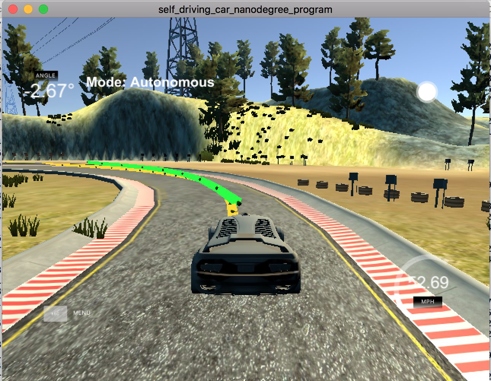
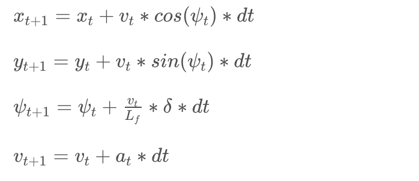
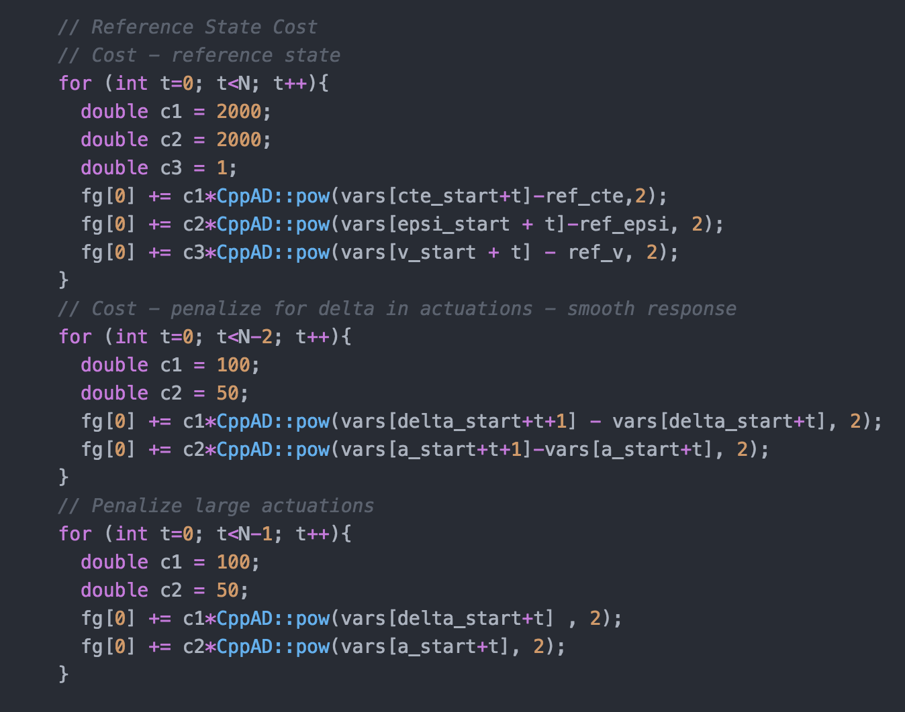

# Model Predictive Control Project
Self-Driving Car Engineer Nanodegree Program

---



## Problem Statement
Implement Model Predictive Control in C++ to drive the car around the track.

## Implementation
### Model
In this project a Model Predictive Control was implemented based on the Kinematic motion model. The state is represented by the vehicle's position (px, py), velocity(v) and orientation (ψ). The actuators or control inputs are [δ,a] (steering angle and throttle). The Kinematic model is represented by the following equations:


This model is used to implement a controller to follow a trajectory.

The errors we are trying to minimize are -
- Cross track error (cte) , which is the distance of the vehicle from the trajectory
- Orientation error (eψ)- the difference in vehicle orientation and trajectory orientation.
These error are appended to the state and the state is now represented as [x,y,ψ,v,cte,eψ]. The errors can be represented as:


The simulator provides the vehicle's position, velocity and orientation and the map co-ordinates of waypoints. First need to transform the waypoints into vehicle co-ordinates and then do a 3rd order polynomial fit to represent the trajectory. Using the trajectory and the vehicle's current position the errors - cte, eψ are calculated. The state [x,y,ψ,v,cte,eψ] and coefficients representing the trajectory are passed to the MPC Solve routine which returns the actuator commands - steering angle and throttle to control the vehicle's motion.

The Solve routine uses a non-linear optimizer (Ipopt) to optimize the control inputs based on the state, cost and constraints defined. Defining the cost and weights associated with each of the contributors:


The steering angle is constrained between [-1, 1] and throttle between [-1,1] - where -1 represents full brake and +1 full throttle.

The model constraints based on the kinematic model are set as:


### Timestep length and duration
The prediction horizon is the duration over which future predictions are made and is dependent on N and dt. N is the number of timesteps in the horizon. dt is how much time elapses between actuations. N determines the number of variables the optimized by MPC. This is also the major driver of computational cost. MPC attempts to approximate a continuous reference trajectory by means of discrete paths between actuations - at dt intervals.

The values N=10, dt=0.1 which translates to a prediction horizon of 1 sec gave good results.

The steering control was oscillating quite a lot with N=20, dt=0.05  


### Polynomial Fitting
A 3rd degree polynomial was used to map the waypoints into a trajectory since a 3rd degree polynomial can represent most roads quite well. The most important thing is to transform the waypoints from map co-ordinates to vehicle co-ordinates and use that to drive the MPC.

### Model Predictive Control with Latency
The code has a 100ms latency implemented in sending the actuator commands back to the simulator to capture the delay in propagating the commands through the system. Any latency can be accounted for in the model by updating the state for the delay and passing that as the initial state of the model. The latency was compensated as follows:


## Result
Using Model Predictive Control to drive the car around the track:
[](http://www.youtube.com/watch?v=K2YEhLdqUGw)

## Dependencies

* cmake >= 3.5
 * All OSes: [click here for installation instructions](https://cmake.org/install/)
* make >= 4.1
  * Linux: make is installed by default on most Linux distros
  * Mac: [install Xcode command line tools to get make](https://developer.apple.com/xcode/features/)
  * Windows: [Click here for installation instructions](http://gnuwin32.sourceforge.net/packages/make.htm)
* gcc/g++ >= 5.4
  * Linux: gcc / g++ is installed by default on most Linux distros
  * Mac: same deal as make - [install Xcode command line tools]((https://developer.apple.com/xcode/features/)
  * Windows: recommend using [MinGW](http://www.mingw.org/)
* [uWebSockets](https://github.com/uWebSockets/uWebSockets)
  * Run either `install-mac.sh` or `install-ubuntu.sh`.
  * If you install from source, checkout to commit `e94b6e1`, i.e.
    ```
    git clone https://github.com/uWebSockets/uWebSockets
    cd uWebSockets
    git checkout e94b6e1
    ```
    Some function signatures have changed in v0.14.x. See [this PR](https://github.com/udacity/CarND-MPC-Project/pull/3) for more details.
* Fortran Compiler
  * Mac: `brew install gcc` (might not be required)
  * Linux: `sudo apt-get install gfortran`. Additionall you have also have to install gcc and g++, `sudo apt-get install gcc g++`. Look in [this Dockerfile](https://github.com/udacity/CarND-MPC-Quizzes/blob/master/Dockerfile) for more info.
* [Ipopt](https://projects.coin-or.org/Ipopt)
  * Mac: `brew install ipopt`
  * Linux
    * You will need a version of Ipopt 3.12.1 or higher. The version available through `apt-get` is 3.11.x. If you can get that version to work great but if not there's a script `install_ipopt.sh` that will install Ipopt. You just need to download the source from the Ipopt [releases page](https://www.coin-or.org/download/source/Ipopt/) or the [Github releases](https://github.com/coin-or/Ipopt/releases) page.
    * Then call `install_ipopt.sh` with the source directory as the first argument, ex: `bash install_ipopt.sh Ipopt-3.12.1`.
  * Windows: TODO. If you can use the Linux subsystem and follow the Linux instructions.
* [CppAD](https://www.coin-or.org/CppAD/)
  * Mac: `brew install cppad`
  * Linux `sudo apt-get install cppad` or equivalent.
  * Windows: TODO. If you can use the Linux subsystem and follow the Linux instructions.
* [Eigen](http://eigen.tuxfamily.org/index.php?title=Main_Page). This is already part of the repo so you shouldn't have to worry about it.
* Simulator. You can download these from the [releases tab](https://github.com/udacity/self-driving-car-sim/releases).
* Not a dependency but read the [DATA.md](./DATA.md) for a description of the data sent back from the simulator.


## Basic Build Instructions


1. Clone this repo.
2. Make a build directory: `mkdir build && cd build`
3. Compile: `cmake .. && make`
4. Run it: `./mpc`.

## Tips

1. It's recommended to test the MPC on basic examples to see if your implementation behaves as desired. One possible example
is the vehicle starting offset of a straight line (reference). If the MPC implementation is correct, after some number of timesteps
(not too many) it should find and track the reference line.
2. The `lake_track_waypoints.csv` file has the waypoints of the lake track. You could use this to fit polynomials and points and see of how well your model tracks curve. NOTE: This file might be not completely in sync with the simulator so your solution should NOT depend on it.
3. For visualization this C++ [matplotlib wrapper](https://github.com/lava/matplotlib-cpp) could be helpful.

## Editor Settings

We've purposefully kept editor configuration files out of this repo in order to
keep it as simple and environment agnostic as possible. However, we recommend
using the following settings:

* indent using spaces
* set tab width to 2 spaces (keeps the matrices in source code aligned)

## Code Style

Please (do your best to) stick to [Google's C++ style guide](https://google.github.io/styleguide/cppguide.html).

## Project Instructions and Rubric

Note: regardless of the changes you make, your project must be buildable using
cmake and make!

More information is only accessible by people who are already enrolled in Term 2
of CarND. If you are enrolled, see [the project page](https://classroom.udacity.com/nanodegrees/nd013/parts/40f38239-66b6-46ec-ae68-03afd8a601c8/modules/f1820894-8322-4bb3-81aa-b26b3c6dcbaf/lessons/b1ff3be0-c904-438e-aad3-2b5379f0e0c3/concepts/1a2255a0-e23c-44cf-8d41-39b8a3c8264a)
for instructions and the project rubric.

## Hints!

* You don't have to follow this directory structure, but if you do, your work
  will span all of the .cpp files here. Keep an eye out for TODOs.

## Call for IDE Profiles Pull Requests

Help your fellow students!

We decided to create Makefiles with cmake to keep this project as platform
agnostic as possible. Similarly, we omitted IDE profiles in order to we ensure
that students don't feel pressured to use one IDE or another.

However! I'd love to help people get up and running with their IDEs of choice.
If you've created a profile for an IDE that you think other students would
appreciate, we'd love to have you add the requisite profile files and
instructions to ide_profiles/. For example if you wanted to add a VS Code
profile, you'd add:

* /ide_profiles/vscode/.vscode
* /ide_profiles/vscode/README.md

The README should explain what the profile does, how to take advantage of it,
and how to install it.

Frankly, I've never been involved in a project with multiple IDE profiles
before. I believe the best way to handle this would be to keep them out of the
repo root to avoid clutter. My expectation is that most profiles will include
instructions to copy files to a new location to get picked up by the IDE, but
that's just a guess.

One last note here: regardless of the IDE used, every submitted project must
still be compilable with cmake and make./
